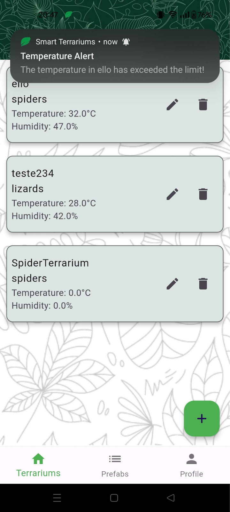

# 🦎 Smart Terrariums

Smart Terrariums is a mobile and ubiquitous computing system designed to monitor and manage terrariums remotely. The solution integrates a **Flutter mobile app**, a **Firebase cloud backend**, and **ESP32-based microcontrollers** with sensors and actuators.

The system enables users to monitor environmental conditions (temperature, humidity, water level, movement), control actuators such as lights and heaters, and receive automatic notifications when thresholds are exceeded.

---

## 📱 Features

* 🔐 **User Authentication:** Secure login through the mobile app
* 🌿 **Terrarium Management:** View, edit, and add terrariums
* ⚙️ **Prefabs System:** Quickly add new terrariums using predefined templates
* 🔔 **Notifications:** Alerts when sensor data exceeds safe thresholds
* 👤 **User Profiles:** Manage personal data
* 💡 **Actuator Control:** Remotely toggle lights and simulate heating
* 📊 **Real-time Data:** Stream sensor data directly from microcontrollers via Firebase

---

## 🏗️ System Architecture

The Smart Terrariums ecosystem consists of three main components:

1. **Mobile Application (Flutter)**

   * Handles user interactions and displays real-time data.
   * Communicates with Firebase and directly with ESP32 devices when possible.

2. **Cloud Service (Firebase)**

   * Uses **Realtime Database** for data storage and synchronization.
   * Implements **Cloud Messaging** for push notifications.

3. **Microcontroller (ESP32)**

   * Reads data from sensors and drives actuators.
   * Hosts a local server for direct communication with the mobile app when on the same network.

---

## 🌡️ Sensors and Actuators

### Sensors

* **Temperature & Humidity Sensor**
* **Water Level Sensor**
* **Motion Sensor**

### Actuators

* 💡 **LED Lamp:** Simulates terrarium lighting
* 🚨 **Alert LED:** Notifies when thresholds are exceeded or resources are low
* 🖥️ **Display Screen:** Shows current sensor readings

---

## 🖼️ Example UI Screenshots 

Below are screenshots showcasing some of the app’s interface and main features.

  
  
  
  
  

---

## 📄 License

This project was developed as part of the *Sistemas de Computação Móvel e Ubíqua (SCMU)* course in NOVA School of Science and Technology.
All rights reserved © 2024.

